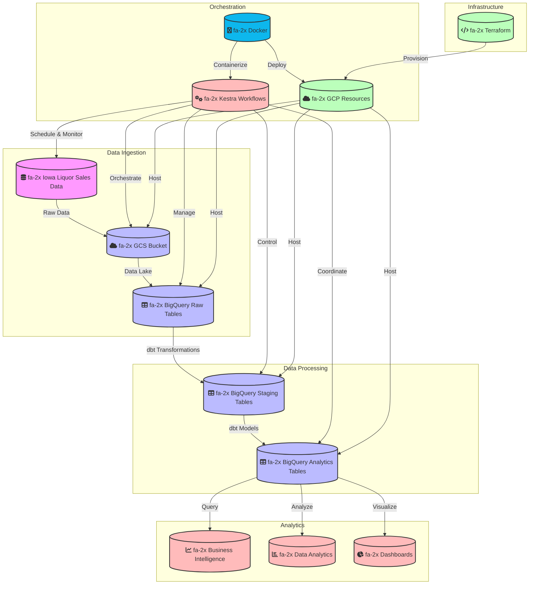

# Iowa Liquor Data Engineering Workflow

This diagram illustrates the complete data engineering workflow for the Iowa Liquor project, now enhanced with larger icons and Docker in the Orchestration section. The workflow is divided into five main components:

1. **Data Ingestion**
   - Raw data from Iowa Liquor Sales is ingested into Google Cloud Storage (GCS)
   - Data is then loaded into BigQuery raw tables

2. **Data Processing**
   - dbt transformations process the raw data
   - Data moves through staging to analytics tables
   - Transformations ensure data quality and consistency

3. **Orchestration**
   - Kestra workflows manage the entire pipeline
   - Docker containerizes and deploys the applications
   - Schedules and monitors data ingestion
   - Orchestrates transformations and data movement

4. **Infrastructure**
   - Terraform manages GCP resources
   - Provisions and maintains all necessary infrastructure
   - Ensures scalability and reliability

5. **Analytics**
   - Processed data enables business intelligence
   - Supports data analytics and reporting
   - Powers interactive dashboards

The workflow is designed to be scalable, maintainable, and follows modern data engineering best practices.
